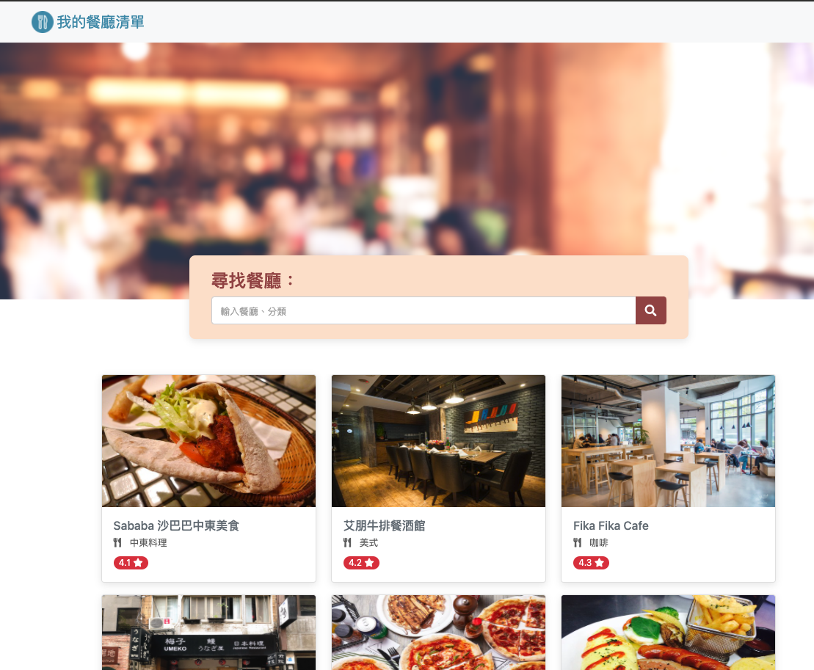
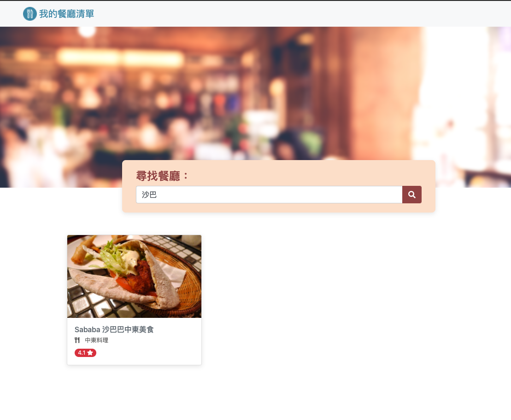

# RestaurantList
A demo web with express.js built
## Features
+ listing restaurants from movie api
+ searching restaurants by title or category
+ click each page to check the detail

## Requirement
+ Node.js
+ npm
  + express.js
  + express-handlebars

## Installation
1. clone the repo to your local 
```
git clone https://github.com/rayray1010/restaurantList.git
```
2. install the dependencies
```
npm install
```
3. run the project
```
npm run start
```

## Example 
### Home Page

### Search Page

